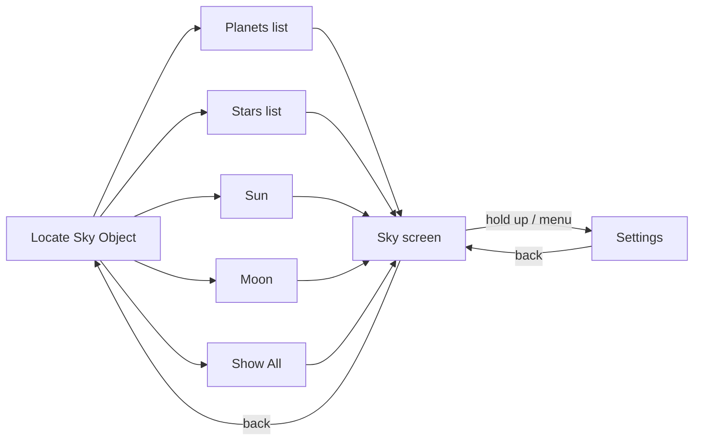
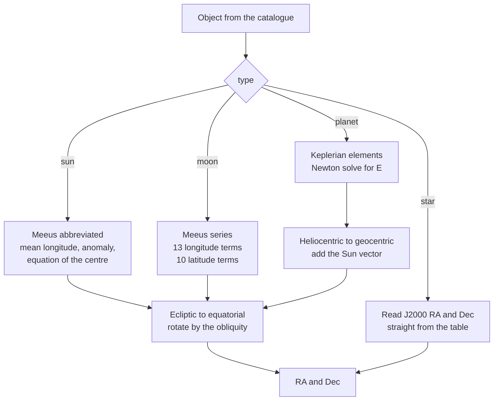
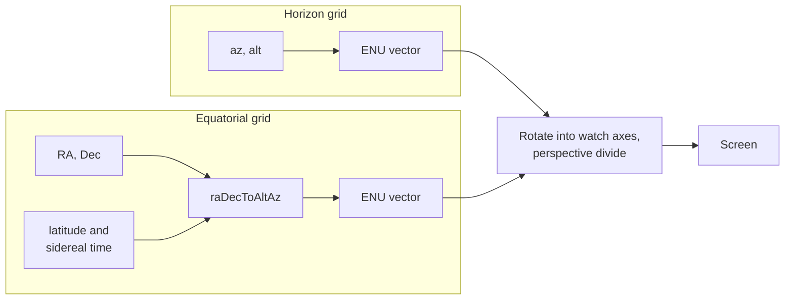
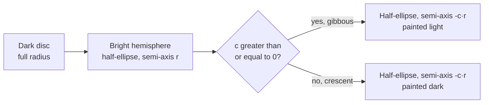

# Miniverse

A sky pointer for Garmin watches. Pick an object — the Sun, the Moon, a planet, a
bright star — hold the watch up with the back facing the sky, and the object is
drawn where it really is behind the case. Move your arm until the marker settles in
the middle of the screen and you are looking straight at it.

It is the idea behind a phone astronomy app held up with its camera, on a wrist,
with no network, no phone, and no chart to orient yourself against first.


## Contents

- [How it works](#how-it-works)
- [Screens](#screens)
- [Settings](#settings)
- [The maths](#the-maths)
  - [1. Time](#1-time)
  - [2. Where the object is](#2-where-the-object-is)
  - [3. Turning that into a direction in the sky](#3-turning-that-into-a-direction-in-the-sky)
  - [4. Corrections](#4-corrections)
  - [5. Where the watch is pointing](#5-where-the-watch-is-pointing)
  - [6. Putting the sky on the screen](#6-putting-the-sky-on-the-screen)
  - [7. The two grids](#7-the-two-grids)
  - [8. Turn-and-tilt guidance](#8-turn-and-tilt-guidance)
  - [9. Drawing the objects](#9-drawing-the-objects)
- [Source map](#source-map)
- [Cost and frame time](#cost-and-frame-time)
- [Building](#building)
- [Devices](#devices)
- [Accuracy](#accuracy)
- [Licence](#licence)

## How it works

The aim axis is the watch's Z axis, straight out through the **back** of the case —
not the 12 o'clock edge. That is what makes it a viewfinder rather than a compass
arrow: you look at the screen, the sky is behind it, and the object is drawn at the
place on the glass you would see it through if the watch were transparent.

Because it is a window, turning your wrist turns what you see through it. The
picture is built in the watch's own frame and rolls with your hand. The written
turn/tilt guidance underneath does **not** — it is measured against gravity,
because it describes how to swing your arm, which has nothing to do with how the
watch is rotated in your grip.

Two independent chains meet at the projection, and the whole thing runs once per
frame at 10 Hz:

```mermaid
flowchart TD
    subgraph SKY["Where the object is"]
        direction TB
        CLK["Clock, UTC"] --> JD["Julian Day<br/>64-bit"]
        JD --> LST["Local sidereal time<br/>GMST plus longitude"]
        JD --> SER["Series and elements<br/>Sun, Moon, planets"]
        CAT["Star catalogue<br/>J2000"] --> RADEC
        SER --> RADEC["Right ascension<br/>and declination"]
        LST --> ALTAZ["Altitude and azimuth"]
        RADEC --> ALTAZ
        LAT["Latitude, from GPS"] --> ALTAZ
        ALTAZ --> CORR["Parallax then refraction"]
        CORR --> ENU["Unit vector<br/>east, north, up"]
    end

    subgraph WATCH["Where the watch is pointing"]
        direction TB
        ACC["Accelerometer"] --> GRAV["Gravity, normalised<br/>and negated"]
        MAG["Magnetometer"] --> NORTH["Magnetic north<br/>vertical part removed"]
        GRAV --> NORTH
        GRAV --> FRAME["Device frame<br/>world axes in watch coordinates"]
        NORTH --> FRAME
    end

    ENU --> OFF["Rotate into watch axes<br/>right, up, forward"]
    FRAME --> OFF
    OFF --> Q{"forward greater<br/>than 0.1?"}
    Q -->|no| DROP["Behind the watch.<br/>Marker pinned to the rim,<br/>grid line broken"]
    Q -->|yes| PROJ["Perspective divide"]
    PROJ --> XY["Screen x, y"]

    style SKY fill:#0d1117,stroke:#30363d
    style WATCH fill:#0d1117,stroke:#30363d
```



Both sensor readings are smoothed as **vectors** before any of this, never as
angles — see [Smoothing](#smoothing).

## Screens



### Aiming at one object


The object name at the top, the marker where the object is, and four readouts. Each
readout pairs the object against the aim on the same axis — `Alt obj +30  aim +25`
— so the two numbers converge as you settle onto it. Showing both halves is
deliberate: a sensor axis wired the wrong way makes the pair diverge as you close
in, which is obvious, instead of just being puzzling.

Within $8^\circ$ of the object the marker takes a green ring and the guidance is
replaced by **On target**. Below the horizon it takes a red one — the object is real
and correctly placed, it is just underneath you.

When the object is off the edge of the view it pins to the rim with a chevron
pointing further the way to move, inset far enough that the marker and its chevron
both stay on the glass.

### Show All


The whole catalogue at once — 35 objects, Sun, Moon, five planets and 28 bright
stars — as a plain sky map. Nothing is being aimed at, so there is nothing to steer
towards and no turn/tilt guidance: the single line at the bottom says only where
the watch is currently pointing.

Objects below the horizon are darkened rather than greyed out, so they still read
as underfoot without losing the colour and the face that identify them. Nothing is
pinned to the rim in this mode — with the whole sky on show, markers would pile up
around the edge — so an object that is not in front of the watch is simply not
drawn.

Above: both grids on at $60^\circ$, the blue horizon grid crossing the red
equatorial one, with `N` at the north point.

### The grids


Aimed near the zenith with the horizon grid at $10^\circ$, where the vertical
circles all converge on the point overhead. The dense end of the range: 36 vertical
circles and 13 circles of equal altitude.

## Settings

Hold the **up/menu** button on any sky screen. Every setting changes what is on the
screen behind, so they are reachable from the screen they affect rather than only
from the root menu. Selecting an item steps it to its next value in place — a short
list is quicker to thumb through than a submenu, and the label cannot go stale
behind the menu showing it.


| Setting | Values | Default |
|---|---|---|
| Horizon Grid | Off · 60 · 45 · 30 · 15 · 10 degrees | Off |
| Equatorial Grid | Off · 60 · 45 · 30 · 15 · 10 degrees | Off |
| Equatorial Motion | Held still · Turns with sky | Held still |
| Azimuth Motion | Held still · Follows position | Held still |
| Update Location | One fix only · every 5 / 15 / 30 / 60 min | One fix only |

Spacings that come to a whole number of hours say so — the sky turns $360^\circ$ in
24 hours, so $15^\circ$ is one hour of it and the grid divides the sky into
hour-wide cells.

Everything starts off and held still. The sky is what the screen is for; a grid over
it is a reference you ask for rather than one you have to dismiss, and a reference
is worth more when it stays where it was put.

**Azimuth Motion** has nothing but position updates to follow — the horizon frame
has no clock in it — so with location updates off it says `On - no updates` rather
than claiming to follow something that never arrives.

The display is held awake while a sky screen is up, re-arming the backlight every 3
seconds. Burn-in protection means the system refuses to hold it on indefinitely
(about a minute at a stretch), so the refusal is caught and the panel given a
10-second rest before asking again.

---

# The maths

Everything below runs on the watch, from the clock and two sensors. No network, no
almanac file, no phone.

## 1. Time

### Julian Day

`SkyMath.julianDay` — the standard Gregorian algorithm. For year $y$ and month $m$,
with January and February counted as months 13 and 14 of the previous year:

```math
a = \left\lfloor \frac{y}{100} \right\rfloor
\qquad
b = 2 - a + \left\lfloor \frac{a}{4} \right\rfloor
```

```math
JD = \big\lfloor 365.25\,(y + 4716) \big\rfloor
   + \big\lfloor 30.6001\,(m + 1) \big\rfloor
   + d + b - 1524.5
   + \frac{h + \dfrac{\mathit{min}}{60} + \dfrac{s}{3600}}{24}
```

**This one must be 64-bit.** A Julian Day this century runs to about $2.46 \times
10^{6}$, and a 32-bit float carries roughly seven significant digits — enough for
the date and nothing whatever for the time of day, which rounds to the nearest six
hours.

Measured against the sky: an observation at 04:06 wants $JD = 2461286.37917$; a
float holds $2461286.5$, and those 2.9 hours moved Saturn from $61^\circ$ up in the
south-west down to $19^\circ$. Whole evenings collapse onto one stored value, so a
position sits frozen and then jumps. The leading `.toDouble()` is what forces the
running total wide — the terms before it are exact whole numbers a float still holds
safely.

### Sidereal time

Greenwich Mean Sidereal Time in degrees, with $D$ the days since J2000 and
$T = D / 36525$:

```math
\mathrm{GMST} = 280.46061837
  + 360.98564736629\,D
  + 0.000387933\,T^{2}
  - \frac{T^{3}}{38710000}
```

```math
\mathrm{LST} = \mathrm{GMST} + \lambda_{\text{obs}}
\qquad (\lambda_{\text{obs}} \text{ east-positive})
```

Also 64-bit, and for the same reason: $D$ is multiplied by 361 before being wrapped
back into a circle, passing through three and a half million degrees on the way.

The $0.98564736629$ is the whole point — the sky turns *slightly more* than
$360^\circ$ per solar day, which is why a star rises about four minutes earlier each
night.

## 2. Where the object is

Every object resolves to a geocentric right ascension $\alpha$ and declination
$\delta$ at a given Julian Day. Four different routes get there:



### Stars — `StarCatalog`

28 naked-eye stars as literal J2000 RA/Dec plus visual magnitude. Proper motion and
precession are ignored; both are far below what a wrist magnetometer can resolve.

### Sun — `SolarLunar.sunPosition`

Meeus, abbreviated. Mean longitude, mean anomaly, equation of the centre, then the
apparent longitude corrected for aberration and nutation:

```math
\begin{aligned}
L_0 &= 280.46646 + 36000.76983\,T + 0.0003032\,T^{2} \\[2pt]
M   &= 357.52911 + 35999.05029\,T - 0.0001537\,T^{2} \\[2pt]
C   &= \left(1.914602 - 0.004817\,T - 0.000014\,T^{2}\right)\sin M \\
    &\quad + \left(0.019993 - 0.000101\,T\right)\sin 2M
          + 0.000289 \sin 3M \\[2pt]
\Omega &= 125.04 - 1934.136\,T \\[2pt]
\lambda &= L_0 + C - 0.00569 - 0.00478 \sin\Omega \\[2pt]
\varepsilon &= \varepsilon_0 + 0.00256 \cos\Omega
\end{aligned}
```

### Moon — `SolarLunar.moonPosition`

The hard one, and the reason there is a series rather than a formula. Built from the
four fundamental arguments — mean elongation $D$, solar anomaly $M$, lunar anomaly
$M'$ and argument of latitude $F$ — with a 13-term longitude series and a 10-term
latitude series. The largest terms:

```math
\begin{aligned}
\Delta\lambda &= 6.288774 \sin M'
   + 1.274027 \sin(2D - M')
   + 0.658314 \sin 2D + \cdots \\[2pt]
\Delta\beta &= 5.128122 \sin F
   + 0.280602 \sin(M' + F)
   + 0.277693 \sin(M' - F) + \cdots
\end{aligned}
```

$6.29 \sin M'$ is the elliptical orbit; $1.27 \sin(2D - M')$ is evection, the Sun
stretching the orbit; $0.66 \sin 2D$ is variation. $5.13 \sin F$ is simply the
$5.1^\circ$ tilt of the Moon's orbit against the ecliptic.

### Planets — `Planets`

Mercury through Saturn from approximate Keplerian elements, in the style of Paul
Schlyter's *How to compute planetary positions*. Each planet's elements — ascending
node $N$, inclination $i$, argument of perihelion $w$, semi-major axis $a$,
eccentricity $e$, mean anomaly $M$ — are linear in the day number.

Kepler's equation has no closed form:

```math
M = E - e \sin E
```

so it is solved by Newton iteration from a first guess, to $10^{-6}$ degrees or
eight passes:

```math
E_0 = M + \frac{180}{\pi}\,e \sin M \,\left(1 + e \cos M\right)
```

```math
E_{n+1} = E_n + \frac{M - \left(E_n - \dfrac{180}{\pi} e \sin E_n\right)}
                     {1 - e \cos E_n}
```

Then true anomaly and radius from the eccentric anomaly, rotated out of the orbital
plane into heliocentric ecliptic coordinates, and the Sun's own geocentric vector
added to shift the origin from the Sun to the Earth:

```math
x_g = x_h + x_\odot
\qquad
y_g = y_h + y_\odot
\qquad
z_g = z_h
```

That last addition is the parallax of the whole Earth's orbit, and it is what makes
Mars swing backwards through the sky a few weeks a year.

### Ecliptic to equatorial

All three computed bodies come out in ecliptic coordinates and are rotated by the
obliquity $\varepsilon = 23.439291 - 0.0130042\,T - \cdots$:

```math
\sin\delta = \sin\beta \cos\varepsilon
           + \cos\beta \sin\varepsilon \sin\lambda
```

```math
\tan\alpha = \frac{\sin\lambda \cos\varepsilon - \tan\beta \sin\varepsilon}
                  {\cos\lambda}
```

## 3. Turning that into a direction in the sky

`SkyMath.raDecToAltAz`. With hour angle $H = \mathrm{LST} - \alpha$ and observer
latitude $\varphi$:

```math
\sin h = \sin\delta \sin\varphi + \cos\delta \cos\varphi \cos H
```

```math
\cos A = \frac{\sin\delta - \sin\varphi \sin h}{\cos\varphi \cos h}
```

```math
A_{\text{az}} =
\begin{cases}
360^\circ - A, & \sin H > 0 \\
A, & \text{otherwise}
\end{cases}
```

Azimuth from north, clockwise through east. The $\sin H$ branch is what resolves the
ambiguity $\arccos$ leaves — east or west of the meridian.

Then to a world East-North-Up unit vector:

```math
\mathbf{t} = \big(\,
  \cos h \sin A_{\text{az}},\;
  \cos h \cos A_{\text{az}},\;
  \sin h
\,\big)
```

## 4. Corrections

Both act along the vertical circle, so azimuth is untouched.

### Parallax

Everything above answers for the **centre of the Earth**. You are 6378 km off that
centre. For the Moon that matters:

```math
h' = h - \pi_{\!h} \cos h
```

where $\pi_{\!h}$ is the horizontal parallax from Meeus' series:

```math
\pi_{\!h} = 0.9508
  + 0.0518 \cos M'
  + 0.0095 \cos(2D - M')
  + 0.0078 \cos 2D
  + 0.0028 \cos 2M'
```

That runs to about $0.95^\circ$ — nearly two full-Moon widths — which is why the
Moon is the only body corrected. The Sun comes to $0.0024^\circ$, the planets at
closest approach to $0.009^\circ$, and the stars to nothing. Earth's polar
flattening would move the answer by about 12 arcseconds and is ignored.

### Refraction

Bennett's formula, giving arcminutes for an altitude $h$ in degrees:

```math
R = \frac{1}{\tan\!\left(h + \dfrac{7.31}{h + 4.4}\right)}
```

About $0.57^\circ$ at the horizon, $0.09^\circ$ at ten degrees up, and negligible
overhead — so it matters for exactly the objects that are hardest to find anyway,
the ones just clearing the skyline. It is what makes the Sun visibly still up when
it has geometrically already set.

## 5. Where the watch is pointing

Two sensors, polled at 10 Hz rather than waited on — the push callbacks fire about
once a second, which is far too slow and too stale to aim with while moving.

### Smoothing

Exponential smoothing applied to the **raw sensor vectors**, not to angles derived
from them:

```math
\mathbf{v}_n = \mathbf{v}_{n-1} + \alpha\left(\mathbf{s}_n - \mathbf{v}_{n-1}\right),
\qquad \alpha = 0.2
```

This is what Stellarium's `SensorsMgr` does and for the same reason: magnetometer
noise is what makes a sky view jitter, and it settles far better averaged as
vectors. Stellarium runs $\alpha = 0.01$ to $0.1$ per frame at display rate and
smooths harder the tighter the field of view; $0.2$ at 10 Hz is the equivalent for
an $8^\circ$ lock.

Heading is smoothed the short way round the circle, so $359^\circ \to 1^\circ$ does
not swing backwards through $358^\circ$.

### Gravity

```math
\hat{\mathbf{u}} = -\,\frac{\mathbf{a}}{\lVert \mathbf{a} \rVert}
```

The sign is a hardware fact, not a choice: this device reports the gravity direction
rather than specific force. Each such convention lives in a named constant with a
check you can run on the pointer screen — aim the back at the horizon and the aim
elevation should read about $0^\circ$; tip it skyward and it should climb.

### Tilt-compensated magnetic azimuth

The system's compass heading is a **flat** reading and goes wrong the moment you
tilt the watch up at the sky, which is the only thing you ever do with this app. So
the azimuth is worked out from the raw magnetometer instead.

Flatten both the field $\mathbf{m}$ and the back axis $\mathbf{b}$ onto the plane at
right angles to gravity:

```math
\hat{\mathbf{n}} = \frac{\mathbf{m} - (\mathbf{m}\cdot\hat{\mathbf{u}})\,\hat{\mathbf{u}}}
                        {\lVert \cdots \rVert}
\qquad
\hat{\mathbf{p}} = \frac{\mathbf{b} - (\mathbf{b}\cdot\hat{\mathbf{u}})\,\hat{\mathbf{u}}}
                        {\lVert \cdots \rVert}
```

```math
A_{\text{mag}} = \mathrm{atan2}\!\big(
  (\hat{\mathbf{p}} \times \hat{\mathbf{n}})\cdot\hat{\mathbf{u}},\;
  \hat{\mathbf{p}} \cdot \hat{\mathbf{n}}
\big)
```

Removing the vertical component of the field is the whole trick — what is left
points north however the watch is tilted. Stellarium does the same, de-rotating the
raw field by the device's own roll and pitch rather than trusting a system heading.

### Magnetic declination

The system heading is worth exactly one thing: while the watch happens to be near
level it is both trustworthy *and* corrected to true north. The gap between it and
the computed magnetic azimuth is therefore the local declination:

```math
\delta_{\text{mag}} \leftarrow \delta_{\text{mag}}
  + 0.05\left(\theta_{\text{system}} - A_{\text{mag}}\right)
```

banked slowly, only while $\lvert \epsilon \rvert < 25^\circ$, and then applied at
any tilt. Averaging stops after 100 near-level samples — well past converged — so
the reference stops creeping. A fresh position re-opens it, if Azimuth Motion is on.

### The device frame

`DeviceAim.deviceFrame` returns the world's axes written in the watch's coordinates,
with $\sigma_H = \pm 1$ for handedness:

```math
\hat{\mathbf{e}} = \sigma_H\,(\hat{\mathbf{n}} \times \hat{\mathbf{u}})
\qquad
\hat{\mathbf{n}},\ \hat{\mathbf{u}} \text{ as above}
```

`viewOffset` then takes a world direction $\mathbf{t} = t_E\hat{\mathbf{e}} +
t_N\hat{\mathbf{n}} + t_U\hat{\mathbf{u}}$ and reads off its components along the
watch's own axes — $\hat{\mathbf{x}}$ at 3 o'clock, $\hat{\mathbf{y}}$ at 12
o'clock, $\hat{\mathbf{z}}$ out through the screen:

```math
\begin{aligned}
\mathit{right}   &= \mathbf{t} \cdot \hat{\mathbf{x}} \\[2pt]
\mathit{up}      &= \mathbf{t} \cdot \hat{\mathbf{y}} \\[2pt]
\mathit{forward} &= -\,\mathbf{t} \cdot \hat{\mathbf{z}}
\end{aligned}
```

Forward is the one that turns round, because the aim is out through the **back**.
All three are direction cosines, ready for a perspective divide.

Keeping that back sign separate from the handedness sign matters: tangling them
flips the sideways and forward components together, the flip cancels in the sideways
divide, and the result can only ever invert up and down — which looks like the
object following the watch instead of sliding against it.

## 6. Putting the sky on the screen

A pinhole camera, with $f$ the focal length in pixels:

```math
x = c_x + f\,\frac{\mathit{right}}{\mathit{forward}}
\qquad
y = c_y - f\,\frac{\mathit{up}}{\mathit{forward}}
```

```math
f = \frac{c_x}{\tan 45^\circ} = c_x
\quad\Longrightarrow\quad
\mathrm{FOV} = 2\arctan\!\left(\frac{c_x}{f}\right) = 90^\circ
```

so the screen spans $90^\circ$ of sky across its width, and the same down its height
on a square display. The perspective divide is what makes the sky line up the way a
camera would, rather than merely pointing in the right general direction: at the
edges of a $90^\circ$ field the difference between the two is large.

Anything with $\mathit{forward} < 0.1$ — more than about $84^\circ$ off the aim — is
level with the back of the watch or behind it, where a perspective projection has
nothing to say. It is dropped, which breaks grid lines cleanly instead of folding
them back across the view.

Nothing is clipped and no band is reserved. The sky is laid down across the whole
display and the text is drawn on top of it afterwards.

## 7. The two grids

They answer different questions, and the difference between them is the point of
having both.

| | anchored to | moves when |
|---|---|---|
| **Horizon** (`HorizonGrid`) — circles of equal altitude, vertical circles between zenith and nadir | the ground and the compass | you move the watch |
| **Equatorial** (`EquatorialGrid`) — circles of equal declination, hour circles between the celestial poles | the stars | you move the watch, **and** as time passes |



The horizon grid takes no clock and no position: $(A_{\text{az}}, h)$ maps straight
to a direction. Rest the watch flat on a table and it looks at the nadir, with the
vertical circles converging in the middle of the screen.

The equatorial grid runs every point through
$\text{raDecToAltAz}(\alpha, \delta, \varphi, \mathrm{LST})$. Sidereal time is the
only thing in that chain that moves, so **pinning LST to one reading is what holds
the grid still** — which is the default. Let loose, it turns at $15^\circ$ per hour,
one full revolution per sidereal day, pivoting about the celestial poles at altitude
$= \varphi$. Turn both on and you can watch the red grid slide past the stationary
blue one.

Both count outwards from their zero line — the horizon, the celestial equator —
rather than up from the bottom, so that line is always drawn whatever the spacing is
set to. It is the one worth guaranteeing.

Cardinal letters are drawn even with the horizon grid off. Which way you are facing
is the most directly useful thing on the screen, and it is not grid furniture.

## 8. Turn-and-tilt guidance

Measured against gravity rather than the watch's own axes, so rolling your wrist
leaves it alone. `aimBasis` builds a frame from the aim direction — heading $\theta$,
elevation $\epsilon$ — plus a horizontal "right" and a perpendicular "up":

```math
\mathbf{d} = \big(
  \cos\epsilon \sin\theta,\;
  \cos\epsilon \cos\theta,\;
  \sin\epsilon
\big)
```

```math
\hat{\mathbf{r}} = \frac{\mathbf{d} \times \hat{\mathbf{z}}}{\cos\epsilon}
                 = \frac{(d_N,\; -d_E,\; 0)}{\cos\epsilon}
\qquad
\hat{\mathbf{u}}_a = \hat{\mathbf{r}} \times \mathbf{d}
```

and `project` puts the object direction $\mathbf{t}$ into it:

```math
\mathit{turn} = \mathrm{atan2}\!\big(
  \mathbf{t}\cdot\hat{\mathbf{r}},\;
  \mathbf{t}\cdot\mathbf{d}
\big)
```

```math
\mathit{tilt} = \mathrm{atan2}\!\left(
  \mathbf{t}\cdot\hat{\mathbf{u}}_a,\;
  \sqrt{(\mathbf{t}\cdot\mathbf{d})^{2} + (\mathbf{t}\cdot\hat{\mathbf{r}})^{2}}
\right)
```

Tilt is measured off the aim's own **horizontal plane**, not straight off the aim
axis. Both amount to the same thing near the object, but this stays well defined
when it is far to one side — where "aim" and "up" both fall to zero and dividing one
by the other is meaningless.

Aimed within a couple of degrees of straight up or down there is no sensible "turn
left" to give, since every direction is sideways from there. Those two lines drop
out; the picture still holds.

## 9. Drawing the objects

`ObjectArt`. Stellarium wraps photographic surface maps onto spheres on the GPU.
None of that survives the trip down to a disc 32 pixels across, and the maps are
equirectangular — made to be projected, not pasted. So what is drawn is the handful
of features still recognisable as *shapes* at this size.

### Moon phase

The real one, from the same geometry Stellarium uses. With $\mathbf{m}$ the
direction to the Moon and $\mathbf{s}$ the direction to the Sun, both unit vectors,
their dot product is the cosine of the elongation and the lit fraction falls
straight out:

```math
k = \frac{1 - \mathbf{m}\cdot\mathbf{s}}{2}
```

What the drawing wants is the terminator ellipse's semi-axis as a fraction of the
disc radius, $c = 2k - 1$, which reduces to simply:

```math
c = -\left(\mathbf{m}\cdot\mathbf{s}\right)
```

running from $-1$ at new, through $0$ at half, to $+1$ at full. The bright limb
faces the Sun, so the whole figure is oriented by the tangent direction from the
Moon towards it:

```math
\mathbf{t} = \mathbf{s} - (\mathbf{s}\cdot\mathbf{m})\,\mathbf{m}
```

taken from the geometry rather than off the screen, which is why it stays right as
your wrist rolls.

It is drawn as a dark disc, then the bright hemisphere, then the terminator ellipse
in whichever colour that side ended up — **two convex half-ellipses rather than one
lune**, because a crescent is concave and how a device fills a concave polygon is
not something to rely on.



### The rest

- **Sun** — corona rings outside the disc, and a disc brightening towards the middle
  for limb darkening.
- **Saturn** — rings, drawn before the disc so the planet sits in front of them.
- **Jupiter** — two belts either side of the equator, which is as much as any small
  telescope shows.
- **Stars** — magnitude-scaled radius
  $r = \mathrm{clamp}\left(5 - \mathit{mag},\, 2,\, 7\right)$, so brighter
  stars draw larger the way they look.

Rings and belts lie along the local horizontal, derived from where the zenith falls
in the watch axes, so they roll with the sky rather than staying pinned to the
screen.

## Source map

| File | What it does |
|---|---|
| `PointerView.mc` | The sky screen: sensors, layout, both modes, drawing |
| `ObjectArt.mc` | Colour, size and face of each body; Moon phase |
| `DeviceAim.mc` | Orientation, tilt-compensated compass, projection |
| `Settings.mc` | Persisted choices, cached in memory |
| `SkyMath.mc` | Time, coordinate conversion, refraction, parallax |
| `HorizonGrid.mc` | Alt/az grid and cardinal letters |
| `EquatorialGrid.mc` | RA/Dec grid |
| `Planets.mc` | Keplerian planetary positions |
| `SolarLunar.mc` | Sun and Moon series, obliquity, parallax |
| `SkyCatalog.mc` | The object registry and RA/Dec dispatch |
| `SettingsMenuDelegate.mc` | Cycling settings in place |
| `SkyMenus.mc` | Menu construction |
| `StarCatalog.mc` | 28 bright stars, J2000 |
| `RootMenuDelegate.mc` | Root menu routing |
| `PointerDelegate.mc` | Back, and the menu button |
| `ObjectMenuDelegate.mc` | Object list routing |
| `MiniverseApp.mc` | Entry point |

## Cost and frame time

`onUpdate` runs at 10 Hz and every plotted grid point costs a handful of trig calls,
so the two things that dominate are grid density and catalogue size.

- **Grids.** A grid at spacing $s$ draws $360/s$ vertical circles and
  $2\lfloor 60/s \rfloor + 1$ circles of equal altitude, each sampled every
  $20^\circ$. At $s = 15^\circ$ that is about 410 plotted points per grid per frame;
  at $10^\circ$ about 610. Both grids on at $10^\circ$ is roughly 1200.
  `AZ_SAMPLE` and `ALT_SAMPLE` are the knob if that ever costs too much.
- **Show All** works out where all 35 objects are at most every 5 seconds and holds
  the result. The sky turns $15^\circ$ an hour, so 5 seconds moves it $0.02^\circ$ —
  well under a pixel — while running the Sun, Moon and planets through their own
  orbital maths ten times a second would cost far more than drawing them does. Only
  the projection is redone per frame. The cache is dropped when your position
  changes.
- **Position** is event-driven, not per-frame. A cached fix is used immediately; if
  nothing usable arrives within 4 seconds the GPS is driven actively.

## Building

Requires the [Connect IQ SDK](https://developer.garmin.com/connect-iq/sdk/) 6.0.2 or
later and a developer key.

```sh
monkeyc -f monkey.jungle -o bin/Miniverse.prg -y developer_key -d instinctcrossoveramoled
```

Run it in the simulator with `connectiq` followed by `monkeydo bin/Miniverse.prg
instinctcrossoveramoled`, or build for the store with `-e -r`.

Permissions: `Positioning` and `Sensor`.

## Devices

27 products, all round displays from 390×390 up. Layout is derived from the display
size and the real font metrics rather than fixed pixel offsets, so the picture takes
every row the text does not need, and labels are pulled in to where the round glass
actually reaches on each row.

`enduro3` · `fenix843mm` · `fenix847mm` · `fenix8pro47mm` · `fenix8solar47mm` ·
`fenix8solar51mm` · `fenix943mm` · `fenix947mm` · `fenix9pro43mm` · `fenix9pro47mm` ·
`fenix9pro51mm` · `fenix9prosolar47mm` · `fenix9prosolar51mm` · `fenixe` ·
`fr57042mm` · `fr57047mm` · `fr970` · `instinct3amoled45mm` · `instinct3amoled50mm` ·
`instinct3solar45mm` · `instinctcrossoveramoled` · `instincte40mm` · `instincte45mm` ·
`venu441mm` · `venu445mm` · `venux1` · `vivoactive6`

## Accuracy

The limit is the magnetometer, not the astronomy. A wrist compass resolves a few
degrees at best, and every approximation here is chosen to sit comfortably
underneath that:

| Source | Error |
|---|---|
| Sun position | $< 0.01^\circ$ |
| Moon position | $\approx 0.02^\circ$ |
| Planets | arcminutes |
| Stars (no proper motion or precession) | arcminutes |
| Refraction (Bennett) | $< 0.02^\circ$ above $5^\circ$ altitude |
| Earth's flattening, ignored | $\approx 12''$ |
| **Wrist magnetometer** | **a few degrees** |

## Licence

GPL-3.0. See [LICENSE](LICENSE).

The approach to sensor handling — smoothing raw vectors rather than angles,
de-rotating the raw field instead of trusting a system heading, and taking the lunar
phase from the elongation — follows [Stellarium](https://github.com/Stellarium/stellarium).
No Stellarium code or assets are used. Solar and lunar series are from Jean Meeus,
*Astronomical Algorithms*; the planetary elements follow Paul Schlyter's *How to
compute planetary positions*.
